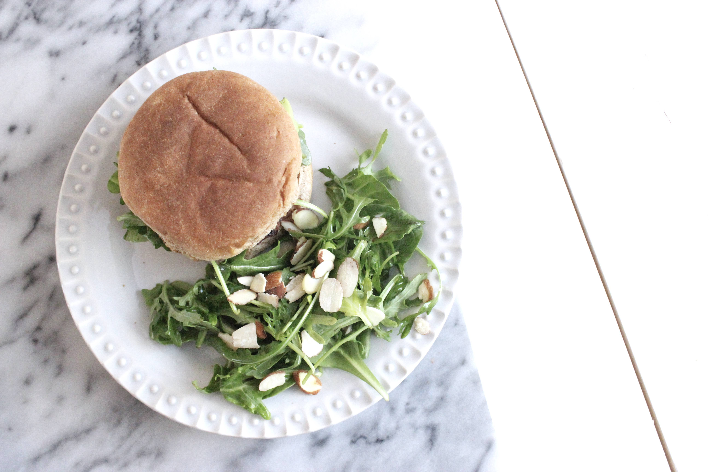
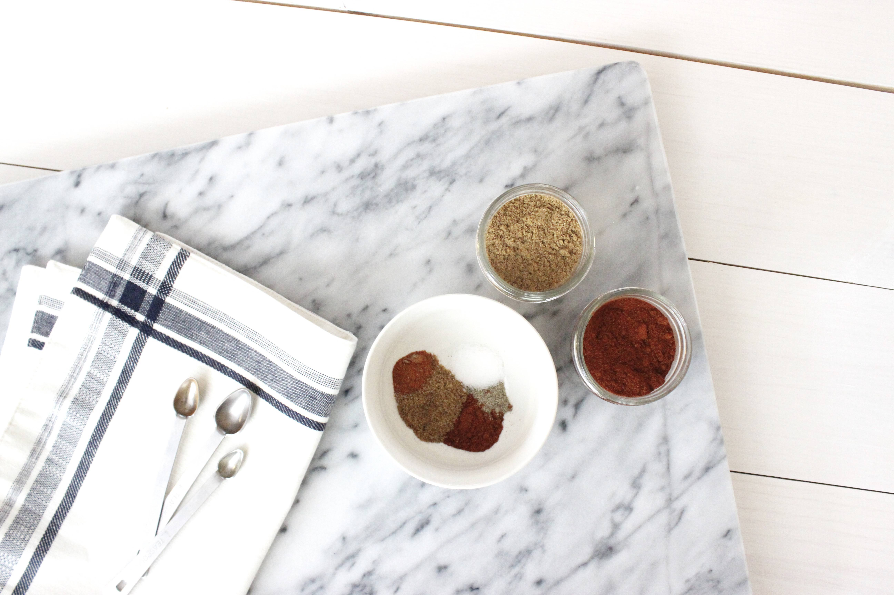
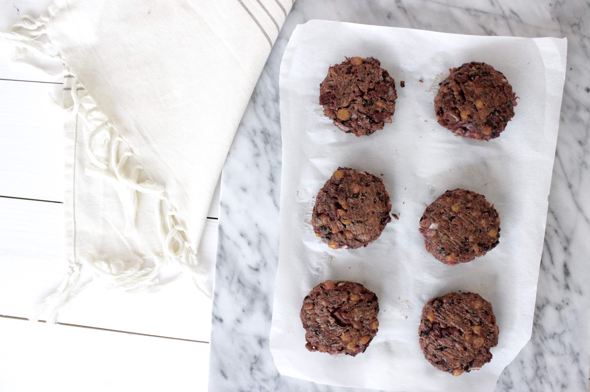
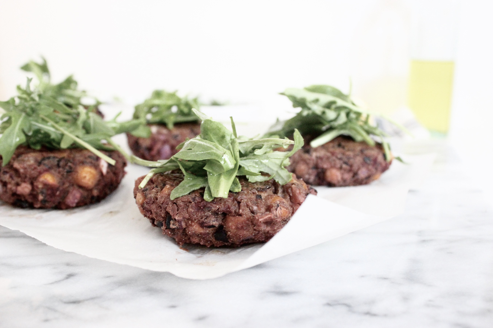

# Beet Burgers

Before I get to the beet burgers I will start off by saying, I’m really not good at this whole blogging thing. To be completely honest, I didn’t really expect the whole process to be as time consuming as it has turned out to be. By “the whole process,” I really do mean a whole process. This whole process involves quite a few steps.

1. The idea inception phase. Sometimes I have more ideas than others.

2. Once I have a great idea, finding the time to execute this great idea becomes a challenge. As I may have previously mentioned, I have a full-time job.

3. Testing out a recipe and shooting the whole process. Believe it or not, taking photos is a lot more time consuming (for me, at least) than it may seem. I would say that pretty much anything I cook takes about twice as long when there’s a camera involved. Additionally, there’s the time of the year to factor in. Natural daylight produces better images but because it’s winter, I can only take advantage of daylight hours over the weekend when I don’t work (sun sets ~5 PM).

4. Quality control. Let’s say I had a great idea, great light, and great photos. At that point, I just have to hope the final product is just as great. I’ve actually taken photos of recipes in the past but haven’t shared because I didn’t think they tasted great.

5. Finally, editing and posting.

I’m not trying to throw myself a pity party over here. Just know that I’m working on it and I haven’t forgotten about this space.

Now… to the beet burgers. I’m sure by now you’ve gathered I’m a vegetarian. Actually, I’m (an almost full-time) vegan. I don’t like to say I’m a full-time vegan because I’m pretty sure I unknowingly eat traces of egg and milk (hidden ingredients in a lot of food) here and there that I don’t know about but for the most part, I try my best to stick to a vegan diet. Now, I’m not here to tell you why should be a vegetarian yourself or anything like that. My only hope is that these recipe posts inspire you to incorporate more plant-based recipes into your day-to-day. This recipe specifically was inspired by a beet burger I had last week at a local Denver restaurant . Beets weren’t exactly something I ate a whole lot of until recently that my husband and I moved from Texas to Colorado. Beets seem to be much more popular over here and I’m definitely not complaining. This beet patty has a great smoky tasty and is pretty easy to make. {Scroll down for full recipe.}

## Ingredients

### Patties

- 1 15oz can black beans
- 1 15oz can beets
- 1 15oz can chickpeas
- 1½ c red onion, finely chopped
- 1 c chickpea flour (or flour of choice)
- ½ tsp paprika
- 1 tsp cumin
- ¼ tsp chili powder
- salt and pepper to taste
- ½ tsp vanilla

Other:

- burger buns
- arugula and spinach for garnish, optional
- avocado, optional

## Instructions 

- Preheat oven to 350 °F.
- Finely chop beets and mix in a bowl with black beans and chickpeas. With a masher, mash beets, black beans, and chickpeas together. It’s okay to leave some whole pieces for texture.
- Mix in onion and spices. Add in chickpea flour and mix until it’s well incorporated.
- Form 2-3 inch patties and place over parchment lined baking sheet. Brush the top of the patties with olive oil and place in over for approximately 25-30 minutes. Remove patties about halfway through and flip. Recipe yields 8-10 patties. *
- Allow patties to cool down for a few minutes after removing from the oven.
- Assemble burgers with garnishes of choice.
 * You can alternately cook these over the stove. Cook in pan with a little bit of olive oil for a few minutes until patties reach desired color.

 – Corinna

