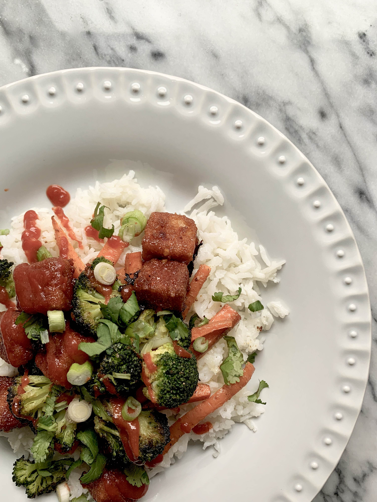
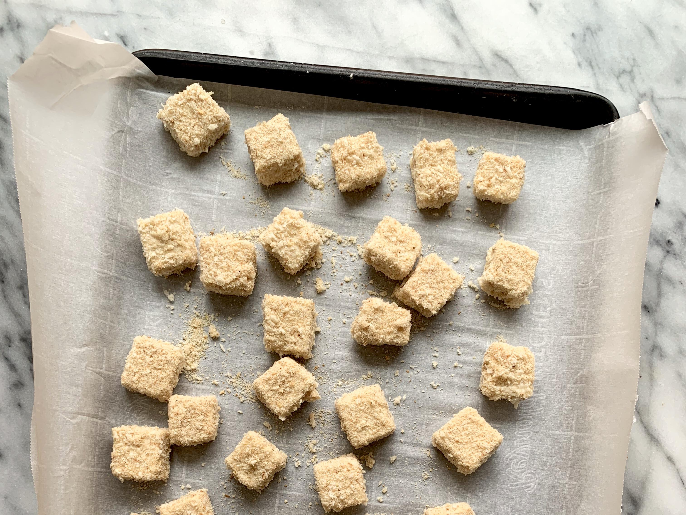
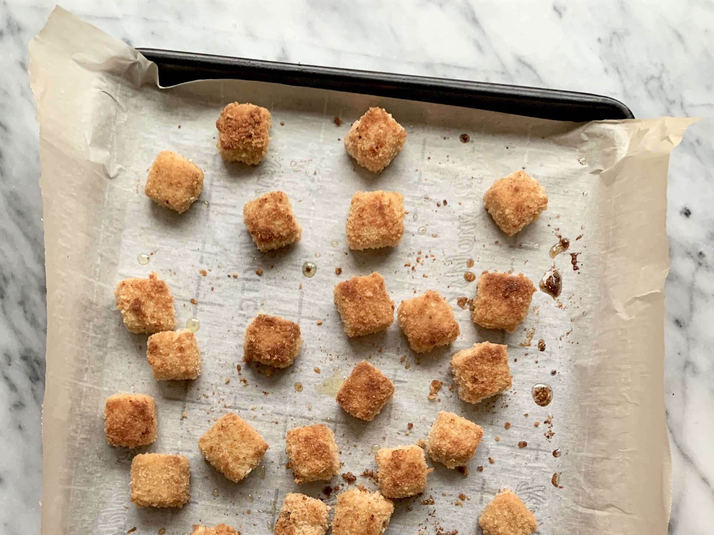
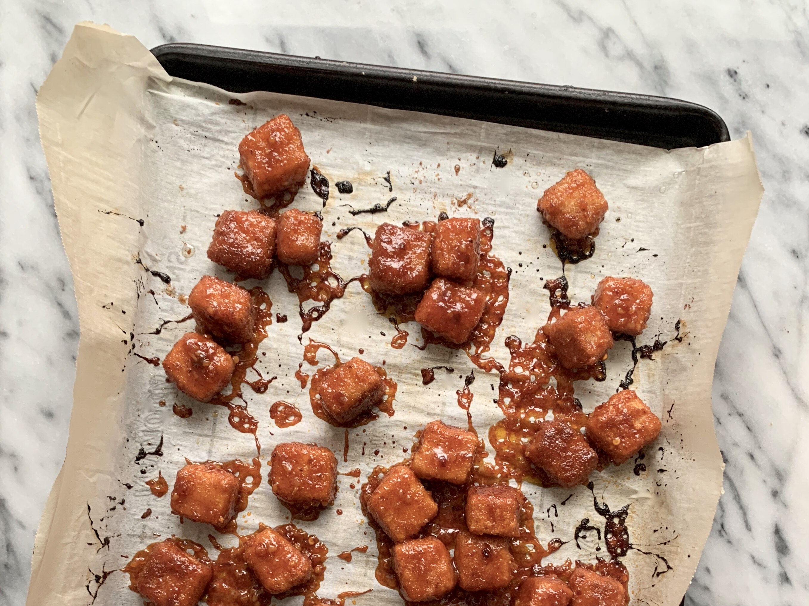

[^url]: sweet-and-sour-tofu

# My favorite breading method featuring sweet n’ sour tofu rice bowls

About once a year, I hop back on here and say something like “I’m back for good!” I admit it, I’m not consistent on here but still hope to be one day. Given how 2020 is shaping up to be, this could be the year! A lot has happened since my last post on here, but those are all stories for another day (i.e., we’re back in Texas, we adopted a sweet stray pup, and we’ve been spending at least a good solid 22 hours a day inside our 1 bedroom apartment for the last five weeks due to the coronavirus pandemic, etc.). It’s only April and what a year it has been already.

Like many of you, we suddenly have quite a bit of extra time on our hands lately. I’d hate to pretend or give the impression that this is what every day for the last five weeks has been looking like for us. Somedays I cook a lot, somedays I’m just overwhelmed by everything that is happening and all the uncertainty around me, other days I manage to not think much about it. But again, that’s for another day.

Today I’m sharing a my all-time favorite breading method. This breading method, that is meant to be used in place of “battering and deep frying,” was about eight to nine years in the making. It kinda started when I first became a vegetarian circa 2011 and I discovered Wheatsville Co-op’s buffalo popcorn tofu in Austin Texas. Y’ALL… many years later, I’m still so in love with that stuff. To make a long story short, from the moment I tasted Wheatsville’s popcorn tofu, I became obsessed with both the tofu and recreating the recipe. There was a lot of trial and error, sometimes the flavor was right but the consistency and texture just wasn’t and other times I nailed the texture but the flavor was all wrong. Throughout this process I also realized that I also don’t enjoy deep frying things at home. It’s messy, it leaves your kitchen smelling like McDonald’s for days, and while I do still love a good french fry, I prefer to leave the fried goods for those times that we eat out from restaurants instead (ignorance is bliss, am I right?!). Same reason why I don’t think I’ll ever own a deep fryer.

To clarify, today I’m not sharing my recreation of the Wheatsville popcorn tofu, but rather, my gained knowledge from years of relentlessly trying to recreate it. Although we use a sweet n’ sour sauce for this recipe, you can swap that out for pretty much any pre-made sauce from the grocery store (we like to use peanut sauce sometimes). Also note that this breading method isn’t just great for tofu, it works amazing on butternut squash, sweet potatoes, eggplant, cauliflower, etc. I will also warn you that it is a bit time consuming and a little messy so I would recommend doing a lot at once (economies of scale… since you’re going through the hassle already) and freezing a portion of the breaded tofu or vegetables before coating in any sauce. Once you’re ready bake, move from the freezer to the refrigerator to thaw overnight, stick in the oven a few minutes to warm up and make sure the inside isn’t frozen, and then pickup at the sauce coating step. So let’s get started!

## Ingredients

### Sweet n’ Sour Sauce 
- 2 tbs arrowroot powder (or cornstarch powder) mixed with 2 tbs water
- 3 tsp sesame oil (or vegetable oil)
- 3 garlic cloves, minced
- 1 tsp fresh ginger, grated
- ½ tsp red pepper flakes
- ½ c white vinegar (regular, white wine, or rice vinegar)
- ¾ c water
- ⅔ c maple syrup (or honey, agave nectar, sugar)
- 3 tbs tomato paste
- 3 tbs soy sauce (or tamari, coconut aminos)
- ½ tsp sea salt

### Breaded Tofu
- 1 14 oz block of extra firm tofu
- ½ c unsweetened plain almond milk (or milk of choice, just make sure it’s plain and unsweetened)
- ¾ c all purpose flour (or gluten-free flour)
- 1 ½ c breadcrumb mixture, ¾ c panko crumbs + ¾ c plain breadcrumbs (or gluten-free breadcrumb alternatives)
- extra-virgin olive oil, for drizzling

### For Serving (optional)
- rice
- roasted vegetables of choice (we used carrots and broccoli)
- cilantro, chopped
- green onions
- soy sauce
- sriracha sauce

## Method

### Sweet n’ Sour Sauce 

1. Mix the the arrowroot powder and cornstarch and set aside.
2. In a small saucepan, heat the oil over medium heat. Add the garlic, ginger, and red pepper flakes and stir until fragrant and being careful not to burn the garlic or ginger (about 30 seconds to a minute).
3. Add in the remaining sauce ingredients and whisk together over medium heat until just bubbling. Then whisk in the cornstarch and water mixture. Whisk frequently for 10 to 12 minutes until thickened and reduced. Remove from the heat and set aside while you bread and bake the tofu.

### Breaded Tofu
1. Preheat oven to 425 °F.
2. Prepare the tofu: Drain and gently press excess moisture from tofu over a kitchen sink. I find that freezing the tofu when I buy it and then moving it to the refrigerator the night before I use, changes the consistency of the tofu  in a way that makes it easier to squeeze that extra moisture without falling apart (freezing the tofu almost gives it a “sponge-like” consistency). Slice the tofu into 1-inch cubes.
3. Breading: In three separate bowls, place 1) the flour 2) the plain almond milk and 3) the breadcrumb mixture. First, coat each piece of tofu evenly with flour by pressing each side of the tofu into the flour bowl. Second, dip each piece of flour-coated tofu into the almond milk bowl so that the outside of the tofu becomes sticky and tacky (be careful not to submerge for too long or the flour will just fall off). Third, transfer the sticky tofu cube into the breadcrumb bowl and, with a spoon, press the breadcrumbs to coat the tofu evenly. The mixture of panko and plain breadcrumbs is what will help us achieve an even and crispy coat.
4. Bake: Place the breaded tofu on a parchment lined baking sheet and lightly drizzle with olive oil. Bake for 20-25 minutes. About halfway through the baking time, flip each piece and drizzle with olive oil again and bake for the remaining time (or until lightly browned at the edges – see middle image below). Take the tofu out of the oven and let it cool for a couple of minutes and, using a silicon brush, evenly brush the sweet n’ sour sauce evenly on each piece. You can also take a spoon and submerge a few pieces of tofu at a time into the saucepan and transfer back to the baking sheet. Place back in the oven and bake for no more than 5 minutes – be careful not to burn the sauce. This extra steps allows the sauce to really stick to the tofu and creates that crispy texture (see third image below). Remove from oven and allow to tofu to cool over the baking sheet before serving.

## Recipe Notes
- You can serve these over a bed of rice and roasted or stir fried vegetables. We topped with coconut aminos (a great  low sodium soy sauce alternative), sriracha sauce, cilantro, green onions, and a squeeze of lime.
- This method is very versatile and works on a number of things in place of deep frying. I’ve used this method to bread butternut squash for tacos, on cauliflower to make buffalo bbq cauliflower “wings,” on eggplant to make eggplant parmesan, etc.

 – Corinna

