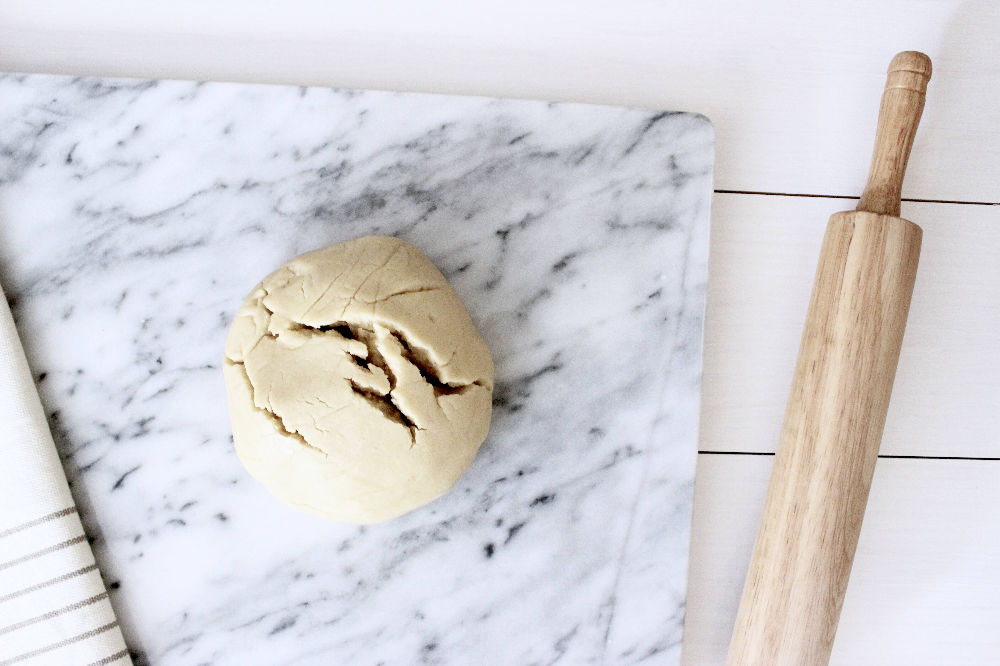

# Almond Thumbprint Cookies

Let’s be honest, if it weren’t for Pinterest I would feel pretty indifferent about Valentine’s Day – but with more festive recipes than I could ever possibly scroll through and red & pink DIYs galore, how can anyone resist?! For me, Valentine’s Day (or any other holiday, really) serves as a good excuse to stay in and put together something extra special in the kitchen. By special, I’m usually referring to sweets. I suffer from major sweet tooth, so for the most part, I try my best to keep sweets out of the house and refrain from making any… unless there’s a special occasion.

The recipe for these cookies is perhaps one of the most simple cookie recipes you will ever follow and its simplicity certainly does not compromise taste. I took some of these cookies to share at work a few days ago and they were quite a hit. The best part, if you ask me, is that they’re vegan. So that makes them healthy, right?

## Ingredients

### Cookies

- 2 c + 2 tbsp unbleached all-purpose flour
- 1 c vegan butter (such Earth Balance or Smart Balance), at room temperature
- ⅔ c granulated sugar
- 1 tsp vanilla
- ½ tsp almond extract (replace with vanilla if allergic)
- raspberry jam (or jam of choice)

### Glaze

- 1 c powdered sugar
- 1 – 2 tbsp almond milk (or milk of choice)
- 1 tbs almond extract (replace with vanilla if allergic)

## Instructions 

### Cookies

1. Preheat ove to 350 °F.
2. With a handheld or stand mixer, beat the butter until creamy (~1-2 minutes).
3. Add the sugar, vanilla, and almond extract to the creamed butter and mix into well incorporated.
4. Add flour and mix at lower speed until a soft dough is formed. You don’t want to over-beat the dough.
5. Place the dough in a zipper freezer bag while you make the glaze.
6. After making the glaze, remove dough from freezer and begin to form balls out of the dough (~1 tbsp of dough per ball). Place on a parchment-lined baking sheet.*
7. With your thumb, form an indentation in the center of each ball and fill with jam of choice.
8. Bake for about 12-15 minutes or until golden brown at the edges.
9. Let cookies cool for about 30 minutes before applying glaze.

*Parchment paper is not necessary but if you’ve never used it before, you’re missing out! Otherwise, lightly spray sheet with non-stick cooking spray.

### Glaze

In a bowl, add the powdered sugar, one tablespoon of almond milk, and almond extract and mix together. Slowly add more almond milk as you mix until you reach the desired consistency.
Scoop glaze into a small zipper bag. Drizzle glaze over cookies by cutting a small corner of the zipper bag and pushing glaze through the bag’s hole.
– Corinna